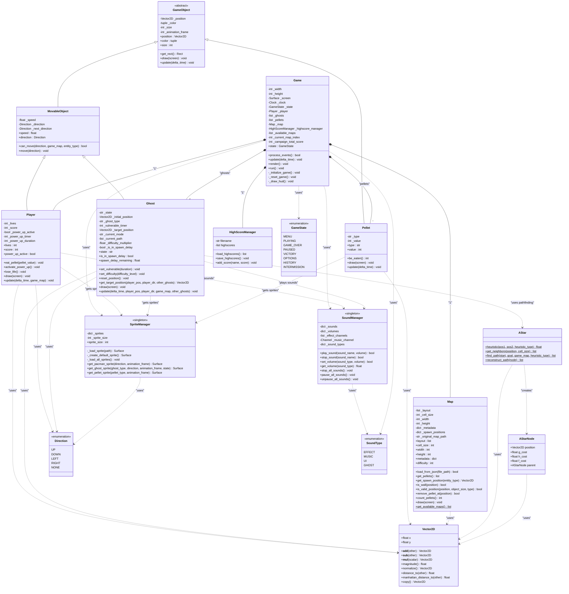

# Diagrama de Classes - Pac-Man OO

Este diagrama mostra a arquitetura completa do projeto Pac-Man orientado a objetos, incluindo todas as classes, interfaces, enumerações e suas relações.

## Arquitetura Geral

O projeto segue uma arquitetura orientada a objetos bem estruturada com:

- **Hierarquia de Herança**: GameObject → MovableObject → (Player, Ghost)
- **Padrões Singleton**: SpriteManager, SoundManager  
- **Composição e Agregação**: Game compõe Player, Ghosts, Pellets, Map
- **Enumerações**: Direction, GameState, SoundType
- **Classes Utilitárias**: Vector2D, AStar, AStarNode

## Diagrama UML

## Principais Conceitos OO Demonstrados

### 1. **Herança**
- `GameObject` → `MovableObject` → `Player`, `Ghost`
- `GameObject` → `Pellet`
- Hierarquia clara com especialização progressiva

### 2. **Abstração**
- `GameObject` como classe abstrata com métodos abstratos `draw()` e `update()`
- Interface comum para todos os objetos do jogo

### 3. **Encapsulamento**
- Atributos privados (prefixo `_`) com properties para acesso controlado
- Métodos privados para funcionalidades internas

### 4. **Polimorfismo**
- Implementações específicas de `draw()` e `update()` em cada classe
- Comportamentos únicos mantendo interface comum

### 5. **Composição**
- `Game` compõe `Player`, `Ghost[]`, `Pellet[]`, `Map`
- Relacionamento "tem-um" forte

### 6. **Padrão Singleton**
- `SpriteManager` e `SoundManager` como instâncias únicas globais
- Garantia de um único ponto de acesso aos recursos

### 7. **Dependency Injection**
- Classes recebem dependências através de parâmetros
- Baixo acoplamento entre componentes

## Benefícios da Arquitetura

- **Manutenibilidade**: Código organizado e modular
- **Extensibilidade**: Fácil adição de novos tipos de objetos
- **Reusabilidade**: Classes base reutilizáveis
- **Testabilidade**: Componentes isolados e testáveis
- **Performance**: Singletons evitam recarregamento de recursos 